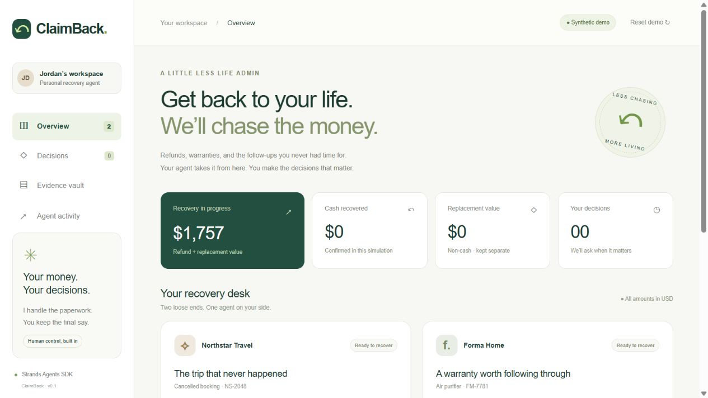
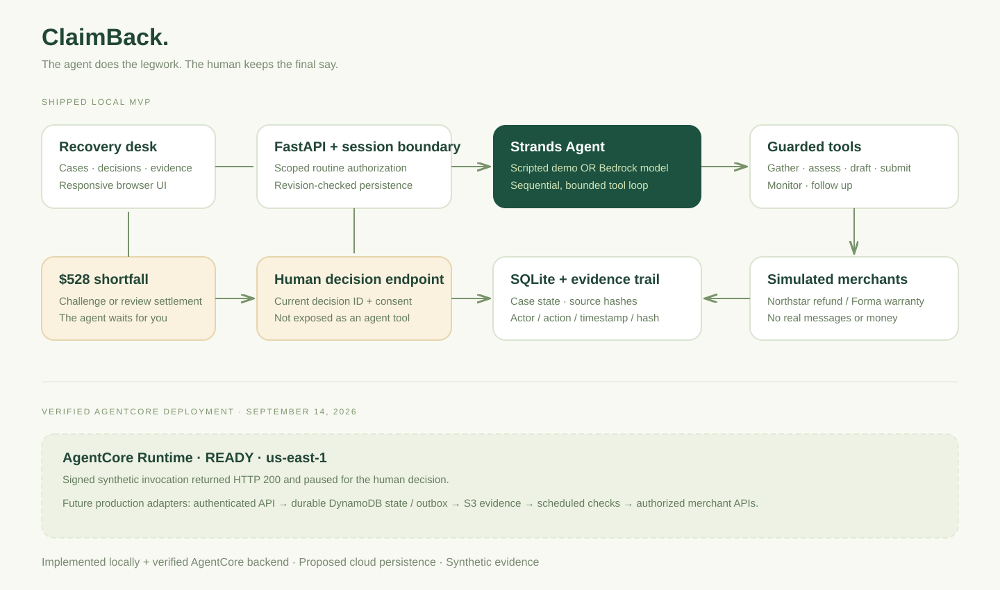

# ClaimBack

**Deployment update (September 14, 2026):** The standalone synthetic agent is now deployed and cloud-tested on AgentCore. See [verified deployment and Free plan status](docs/AWS-DEPLOYED.md). This supersedes earlier not-deployed statements below; the web UI remains local and Bedrock inference remains unverified.

**Get back to your life. We’ll chase the money.**

A Strands-powered recovery desk for people who lose time to refund paperwork and warranty follow-ups. The agent gathers evidence, builds a claim, submits within the user's scope, checks status and follows up. Humans control settlements and compromises.

Built for the AWS Agents for Humans Hackathon. Suggested track: **Everyday Agents**, matching the hackathon description supplied in the original conversation. MIT licensed.



## Try it locally

Python 3.11+ recommended. From this repository directory:

```sh
python -m venv .venv
# macOS / Linux:
source .venv/bin/activate
# Windows PowerShell instead:
# .venv\Scripts\Activate.ps1
python -m pip install -r requirements.txt
python -m uvicorn claimback.api:app --host 127.0.0.1 --port 8765
```

Open **http://127.0.0.1:8765**. No AWS account, API key, frontend build or external font is needed for the default demo. Internet is needed once to install dependencies. `start.ps1` is a Windows convenience launcher.

## A two-minute walkthrough

1. On Northstar Travel, choose **Review & start**, read the authorization scope, then **Authorize & start simulation**.
2. The Strands agent gathers three sources, checks synthetic policy eligibility, drafts and submits the request, and discovers an $880 offer against $1,408 requested. It stops at a **$528 shortfall decision**.
3. Choose **Authorize challenge**, then **Run agent** to receive a simulated $1,408 refund confirmation. Alternatively, review the partial settlement and explicitly acknowledge the $528 shortfall before accepting $880.
4. Start Forma Home. The agent checks the 365-day warranty, submits evidence and follows up after a simulated three-business-day advance. Choose **Check response** for the replacement confirmation.
5. Open **Evidence vault** and **Agent activity**. Read the source-linked draft, inspect human/agent actions and export the full JSON evidence package.
6. **Reset demo** restores the two synthetic cases in your browser session.

## What runs today

| Capability | Implementation |
|---|---|
| Core orchestration | Real Strands `Agent`, six `@tool` tools, sequential tool execution, bounded model/tool calls |
| Offline model | Explicitly scripted `DemoModel`; drives the actual Strands event loop, no LLM inference |
| Bedrock model | Configurable `BedrockModel` using the same guarded tools; needs AWS credentials/model access; not cloud-validated in this build |
| Merchant actions | Simulated in both modes; no real messages, claims, refunds or transfers |
| Refund | Evidence → policy check → draft → authorized submission → partial offer → human choice → confirmation |
| Warranty | Receipt + fault log + policy → eligibility → authorized claim → follow-up → replacement |
| Audit | Timestamped, SHA-256-linked events and source hashes; downloadable Strands tool transcript |
| Persistence | SQLite, per-browser random HttpOnly session cookie, optimistic concurrency |
| AgentCore | SDK entrypoint and ARM64 container recipe for a standalone synthetic invocation; deployment design included |
| Broader claims/reimbursements | Product expansion path; only the two named fixture flows are implemented |

This MVP validates workflow and decision boundaries. It does not read a real inbox, identify real entitlements, adjudicate warranties or integrate with live merchant APIs. Displayed money and outcomes are synthetic. Replacement value is never counted as cash recovered.

## Architecture



See [architecture and cloud boundaries](docs/ARCHITECTURE.md), [AgentCore deployment](docs/DEPLOYMENT.md), and [decision policy](docs/DECISION-POLICY.md).

## Bedrock reasoning mode

Set variables in your shell (the application does not auto-load `.env`). Use your own enabled model ID and credentials from the standard AWS credential chain; never put credentials in this repository.

```sh
export CLAIMBACK_MODE=bedrock
export AWS_REGION=us-west-2
export BEDROCK_MODEL_ID=<your-enabled-model-or-inference-profile-id>
python -m uvicorn claimback.api:app --host 127.0.0.1 --port 8765
```

PowerShell uses `$env:CLAIMBACK_MODE='bedrock'` and equivalent assignments. Model failures appear as errors; there is no silent simulation fallback. Even in this mode all merchant operations remain simulated. Ordinary drafts are deliberately assembled by trusted tools from case facts; the model chooses tools, not settlement authority.

## Tests

```sh
python -m pip install -r requirements-dev.txt
python -m pytest -q
```

Tests exercise the real offline Strands loop, both outcomes, settlement acknowledgement/replay protection, expired warranty rejection, submission prerequisites, session isolation, concurrency conflicts and audit mutation detection. See [verification](docs/VERIFICATION.md).

## Repository guide

```text
claimback/             domain rules, Strands agent, API, SQLite store
frontend/              responsive web UI; no build step
data/synthetic_demo/   two fictional cases and six evidence sources
tests/                 integration and policy regression tests
docs/                  architecture, deployment, Devpost draft, demo script
agentcore_entry.py     AgentCore SDK entrypoint
Dockerfile             local/demo web service
Dockerfile.agentcore   ARM64 AgentCore runtime image
.github/workflows/     test workflow
LICENSE                MIT
```

## Judging and submission materials

- [Devpost submission draft](docs/DEVPOST-DRAFT.md)
- [4 minute 40 second demo script](docs/DEMO-SCRIPT.md)
- [Rules-derived submission checklist](docs/SUBMISSION-CHECKLIST.md)
- [Judging criteria map](docs/JUDGING.md)
- [Pre-existing work disclosure](docs/PREEXISTING-WORK-DISCLOSURE.md)

The uploaded rules set the deadline to **September 14, 2026, 5:00 PM Pacific**. A public code repository and a public YouTube/Vimeo video of at most five minutes are required. This local build does not constitute a published repository, deployed service, recorded video or Devpost submission.

## Practical limits

Local synthetic demo only: anonymous sessions are not user accounts. Do not use with private evidence. SQLite is not a shared AgentCore datastore; the AgentCore entrypoint starts a standalone case and returns its trace. Live connectors, authenticated tenants, durable cloud state, background scheduling, real policy extraction, encryption/retention controls and merchant idempotency contracts remain future integration work. Local hash linkage is not externally anchored tamper-proof storage. Do not claim measured user savings or real recovered money.

Official implementation references: [Strands Python quickstart](https://strandsagents.com/docs/user-guide/quickstart/python/), [Strands tools](https://strandsagents.com/docs/user-guide/concepts/tools/), [AgentCore Python deployment](https://docs.aws.amazon.com/bedrock-agentcore/latest/devguide/runtime-get-started-code-deploy-python.html).
