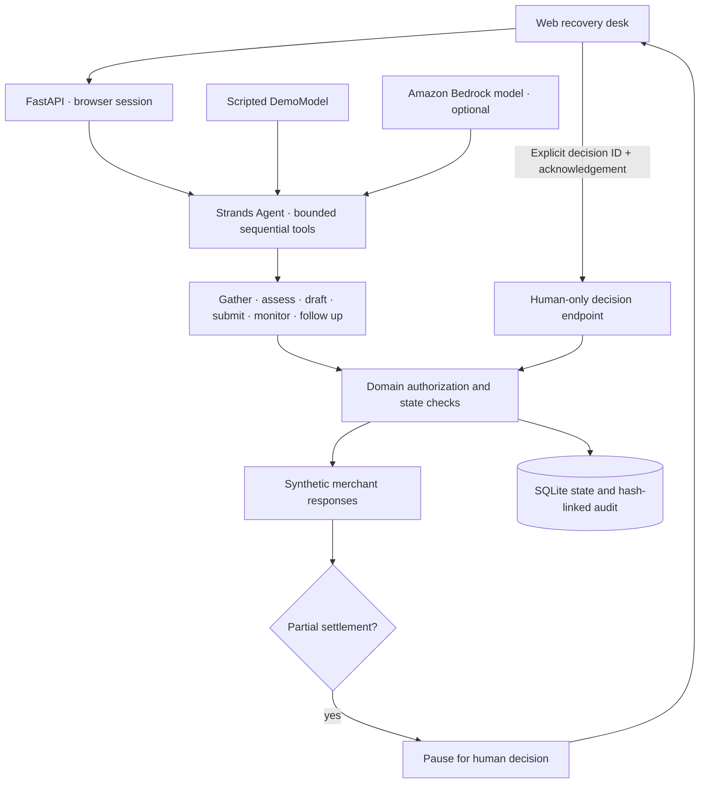
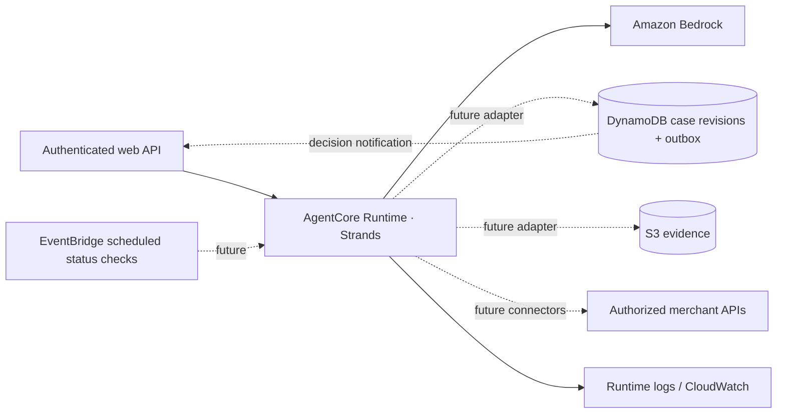

# Architecture

The shipped local application has one browser UI, one FastAPI service, one Strands agent per run, a guarded domain layer, synthetic merchant tools and SQLite. There is no live merchant connection.

## The authority boundary

The model receives only tools bound to one case. No tool can grant authorization, choose a different case, accept a settlement or waive rights. The human API accepts a current decision ID, validates the case state, and requires an additional acknowledgement for partial settlement. A repeated or stale decision is rejected. The model's output text never changes authoritative state.

Tools execute sequentially. The run limits tool execution to ten calls and model calls to twelve. Submission and follow-up have duplicate guards. SQLite writes use compare-and-swap revisions so a stale browser action cannot overwrite a newer state. Because merchants are simulated, a losing concurrent update has no external side effect. A real connector must instead use a durable outbox and merchant idempotency keys.

## Evidence and integrity

Each synthetic evidence item has a stable ID, source URI, content and SHA-256 digest. Audit events identify actor, action, time, payload, predecessor hash and event hash. Export includes model tool-use messages and an audit verification result. Hash linkage detects modifications relative to the supplied chain; it does not prevent an administrator rewriting the whole chain. A production version should independently anchor event hashes and use restricted append-only storage.

## Verified cloud deployment

The supplied `agentcore_entry.py` runs as a standalone synthetic invocation on Amazon Bedrock AgentCore in `us-east-1`. The runtime reached `READY`, and a signed invocation returned HTTP 200 while preserving the human-decision pause. It starts a fresh fixture, requires `authorize_simulation=true`, runs Strands and returns state and evidence. It exposes no settlement action. The public Vercel browser demo uses its scripted FastAPI backend; wiring it to the authenticated AgentCore runtime and implementing durable cloud state are next integration steps.

## Extending beyond the two fixtures

Create typed connectors for source acquisition, policy extraction, submission and status, each with scoped authorization and source provenance. Reimbursements need expense policy, amount/currency checks and approval routing; insurance claims need domain-specific review and stronger controls. Do not reuse the fixture eligibility checks as general entitlement rules. Any fee, altered settlement, release, compromise or rights waiver must create a new versioned human decision.
